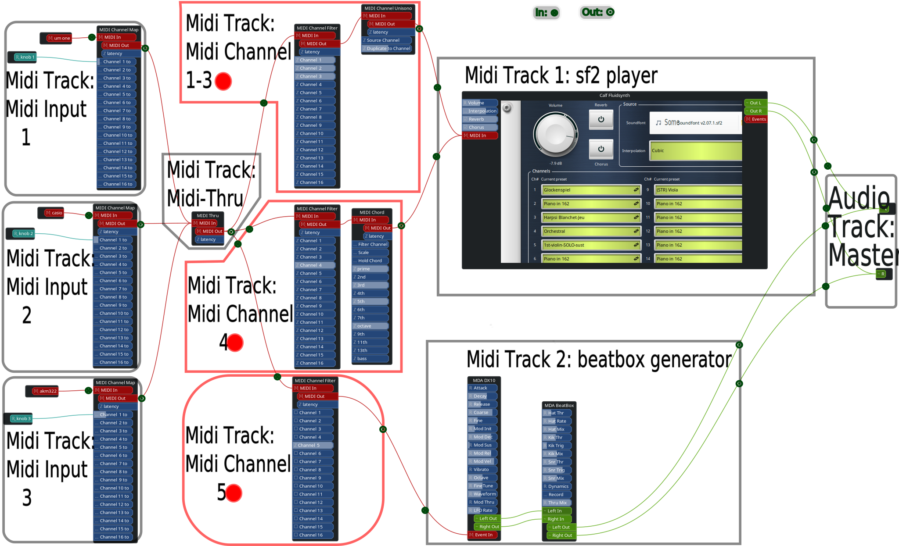
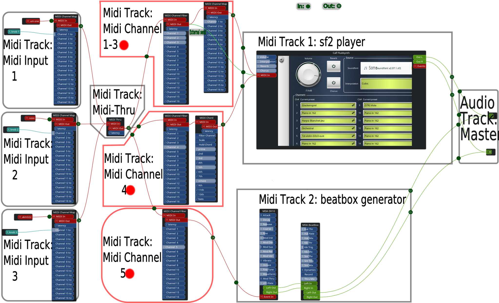
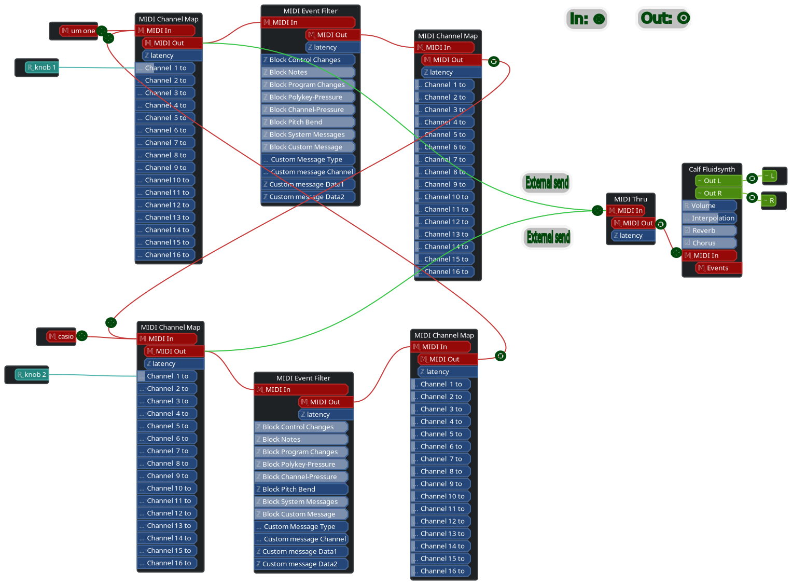

# Midi wiring using X42 plugins explained with Ingen and Ardour

##### Normal:

##### With External-Send feature in Ardour:

##### With External-Send and Feedback:

*SVG's are created with Ingen and later edited with Inkscape

##### Software Used:

- [Ingen](https://drobilla.net/software/ingen.html)
- [x42](https://x42-plugins.com/x42/midi)
- [Ardour](https://ardour.org/)
- [Inkscape](https://inkscape.org/)
- [MDA-lv2](https://drobilla.net/software/mda-lv2.html) _Linux only, checkout MDA-vst for other platforms_

##### Recommended To Checkout:

- [thepiz midiCurve](https://web.archive.org/web/20180513135004/http://www.thepiz.org/plugins/?p=midiCurve)
- [MDA-vst](https://web.archive.org/web/20200204234446/http://mda.smartelectronix.com/)

[Video Tutorial](https://youtu.be/XLbxgM_VACs)

